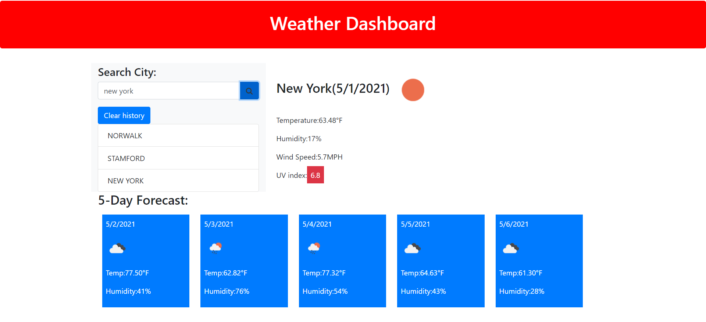

# weatherdashboard

## **Project Summary** ⚡️

_For travelers who want to see the weather outlook for multiple cities so they can plan a trip accordingly._

__________________________________________________________________________________________________________________________________________________

## **Tools Used** 🛠️

* HTML
* CSS
* Javascript
* Third Party API's
___________________________________________________________________________________________________________________________________________________

## **Project Goals** 📚

* When searched for a city, then presented with current and future conditions of that city and added to the search history.
* Presented with the city's name, the date, an icon of the weather conditions, temperture, humity, wind speed and uv index.
* Presented with a 5 day forcast displays the date, an icon representation of weather conditions, the temperature, and the humidity.
* Displayed is a search history that can be viewed again and then presented with current and future conditions for that city.

___________________________________________________________________________________________________________________________________________________

## **Website** 📷

*Screenshots of prompts.*

___________________________________________________________________________________________________________________________________________________

## **Recourses** 💡
[ Javascrpit: W3sschools](https://www.w3schools.com/)

[My Github: Live website](https://katherineyoguez.github.io/workscheduler/)

___________________________________________________________________________________________________________________________________________________

### _Contact_ 📇

Email: Katherinecarlotayoguez@gmail.com